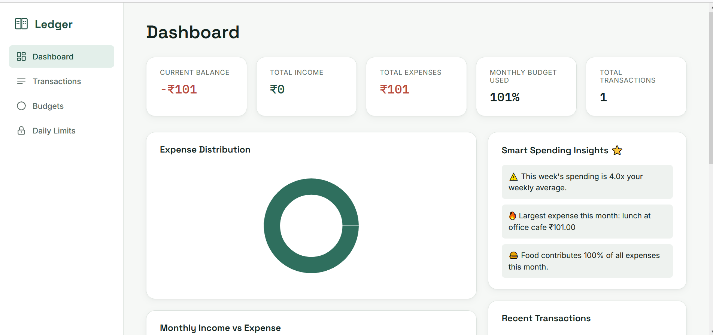
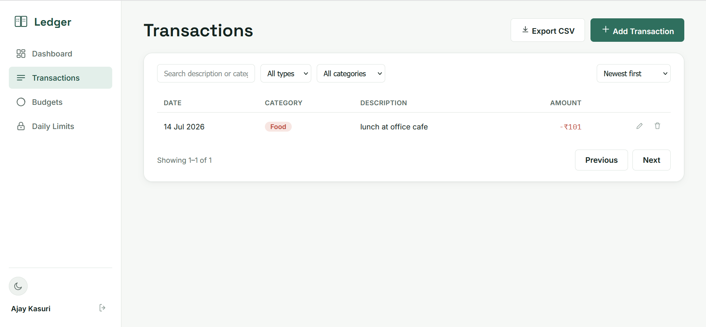
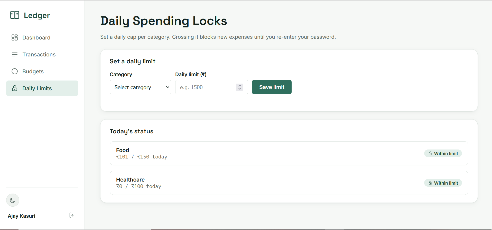
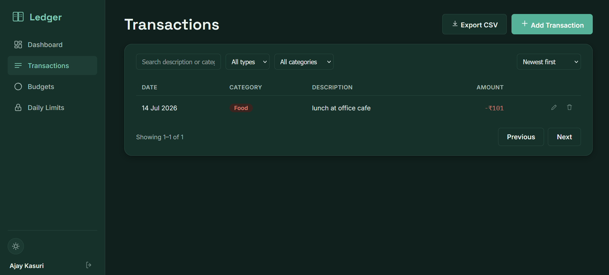

#  Mini Smart Ledger

A full-stack personal finance application built for the **Bytex Smart Mini-Ledger Challenge**.

The application allows users to securely manage income and expense transactions, organize them into categories, monitor budgets, receive notifications when spending exceeds limits, and gain insights into their spending habits.

Rather than implementing only the required CRUD functionality, the project focuses on production-oriented engineering decisions such as offline support, caching, security, and user experience.

---

# Tech Stack

## Frontend

* React (Create React App)
* React Router
* TanStack Query
* React Hook Form
* Axios
* React Hot Toast
* Recharts
* Plain CSS
* Hand-authored SVG Icons

## Backend

* Node.js
* Express.js
* MySQL (`mysql2/promise`)
* JWT Authentication
* bcrypt
* Redis (Dashboard caching)

## Notifications

* Discord Webhooks (Budget Alerts)
* Nodemailer (Security Notifications)

---

# Screenshots

## Dashboard



## Dashboard theme



## Daily Spending Lock



## Transaction


# Features

### Authentication

* JWT-based authentication
* Password hashing using bcrypt
* Protected API routes

### Transaction Management

* Add transactions
* Edit transactions
* Delete transactions
* Filter by category
* Filter by transaction type
* Monthly summaries

### Categories

* Income categories
* Expense categories
* Category-wise spending analysis

### Dashboard

* Income vs Expense overview
* Monthly spending charts
* Budget utilization
* Smart Spending Insights

### CSV Export

Export filtered transactions into CSV format.

### Budget Alerts

Users can define monthly budgets for categories.

Whenever spending crosses the configured budget, the application automatically sends a Discord notification.

Duplicate notifications are prevented using a dedicated `budget_alerts_sent` table so the same budget crossing is notified only once per month.

---

# Unique Twists

Instead of stopping at the assignment requirements, I implemented additional features that improve the real-world usability of the application.

---

## 1. Daily Spending Locks

One feature I wanted to build was a spending safety mechanism.

Users can configure a daily spending limit for each expense category.

Whenever a transaction exceeds that limit, the transaction is blocked immediately.

The user must re-enter their account password before continuing.

The override can be granted for:

* Only this transaction
* The rest of the day
* Next N transactions

If the wrong password is entered three consecutive times, further override attempts are temporarily locked and an email notification is automatically sent to the account owner.

### Why per-category instead of one global lock?

A global override becomes a blanket permission to overspend anywhere.

A category-specific override keeps the permission limited to exactly what the user intended.

For example:

> "I'm okay spending more on Food today."

should **not** automatically allow extra spending on Shopping, Entertainment, or Travel.

Keeping overrides scoped to individual categories reduces accidental overspending and provides much finer control.

---

## 2. Offline Transaction Queue

A common problem with finance applications is failed requests during unstable internet connections.

Instead of losing user input, the application queues offline transactions in `localStorage`.

Once internet connectivity returns, transactions automatically synchronize with the server in the order they were created.

If a queued transaction violates a Daily Spending Lock during synchronization, it does **not** stop the remaining queued transactions.

Instead, it is moved into a **Needs Attention** state where the user can resolve it later using the same password override flow.

### Why?

Blocking the entire queue because of one failed transaction creates a frustrating user experience.

Allowing independent resolution keeps synchronization reliable while still enforcing spending rules.

---

## 3. Smart Spending Insights

The dashboard includes a lightweight insights engine that converts transaction history into readable observations.

Examples include:

* You spent 42% more on Food than last month.
* Transport spending increased this week.
* Shopping accounted for 35% of all expenses.
* Largest expense this month.
* Savings compared to the previous month.

The insights engine is implemented as a pure function independent of the database, making it easy to test and extend.

---

## 4. Redis Dashboard Caching

Dashboard statistics are cached for 60 seconds using Redis.

Whenever transactions are added, edited, or deleted, the cache is immediately invalidated.

This provides:

* Faster dashboard loading
* Reduced database queries
* Always up-to-date information after edits

---

# Project Structure

```text
backend/
 ├── controllers/
 ├── middleware/
 ├── models/
 ├── routes/
 ├── services/
 ├── utils/
 └── db/

frontend/
 ├── components/
 ├── hooks/
 ├── pages/
 ├── services/
 ├── utils/
 └── styles/
```

---

# Setup

## Database

```bash
mysql -u root -p < backend/db/schema.sql
```

---

## Backend

```bash
cd backend

cp .env.example .env

npm install

npm run dev
```

Runs on:

```
http://localhost:5000
```

---

## Frontend

```bash
cd frontend

cp .env.example .env

npm install

npm start
```

Runs on:

```
http://localhost:3000
```

---

## AI Usage

### AI Tools Used

* ChatGPT
* GitHub Copilot

### How AI Accelerated Development

AI acted as a development assistant rather than writing the application end-to-end. It helped with:

* Scaffolding Express routes and controllers
* Generating initial CRUD boilerplate
* Structuring React components
* API integration patterns
* Form validation using React Hook Form
* Initial documentation and README drafting
* Drafts for empty states and error messages


### Where AI Fell Short

While AI accelerated repetitive development, several important parts required manual engineering decisions.

* It soley relied on on `useEffect` and local component state and i usggesting using **TanStack Query** for server-state management instead of relying solely on `useEffect` and local component state.

* AI suggested straightforward spending limit validation, but I redesigned it into **Daily Spending Locks** with password verification, scoped overrides, failed-attempt cooldowns, and email notifications.
* AI's offline handling focused on simple request retries. I instead implemented an **offline queue** that persists transactions, synchronizes automatically on reconnect, and allows individual conflict resolution without blocking the remaining queue.
* Used redis for catching AI assited me in implementing it,as am new to redis.
* AI-generated budget notification logic could easily produce duplicate alerts. I added monthly alert de-duplication using a dedicated tracking table.
* AI produced generic spending statistics. I extracted the logic into a standalone **Insights Engine** that generates readable spending observations while remaining independent of the database layer and easy to test.

AI significantly reduced development time, but the architecture, feature design, engineering trade-offs, and final implementation decisions were made manually.

# Known Limitations

* Offline transactions are stored in `localStorage` and are not encrypted.
* Categories are not currently cached for offline page refreshes.
* CSV export loads the entire filtered dataset into memory instead of streaming.
* JWT authentication uses long-lived tokens without refresh token rotation.
* Spending insights are based on simple month-over-month comparisons and are not seasonally adjusted.
* Dashboard cache TTL (60 seconds) is fixed and not dynamically tuned.
* Automated tests for Offline Queue, Spending Locks, and Redis caching have not yet been added.

---

# Future Improvements

* Refresh Token authentication
* IndexedDB for encrypted offline storage
* Offline category caching
* Real-time dashboard updates using WebSockets
* PWA support
* Automated integration and unit tests
* Advanced AI-powered spending predictions

---

# Final Thoughts

The assignment asked for a simple financial ledger.

I treated it as an opportunity to explore production-oriented engineering concepts such as offline-first design, cache invalidation, secure spending authorization, notification deduplication, and clean separation of business logic.

AI accelerated repetitive coding tasks, but the architecture, feature design, engineering trade-offs, and implementation decisions were made manually to create a more robust and maintainable application.
